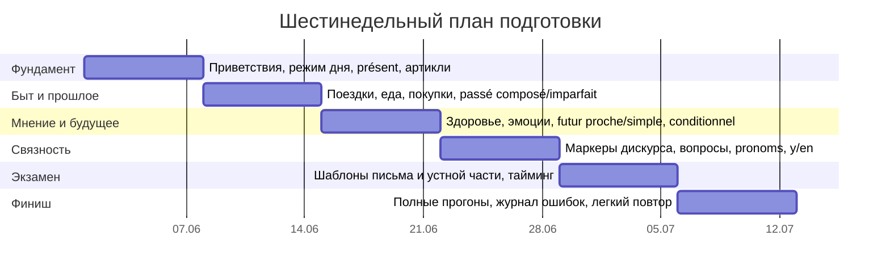
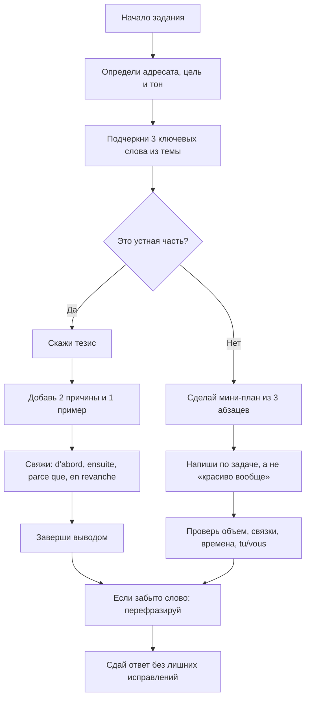

# Шпаргалка по TCF для перехода от A2 к B1

## Краткое резюме

Эта шпаргалка ориентирована прежде всего на классический формат TCF tout public, TCF Canada и TCF Québec: в письменной части там три задания на 60 минут, а в устной — три задания примерно на 12 минут, включая 2 минуты подготовки ко второй устной задаче. Для TCF IRN структура и время иные, поэтому ниже я сознательно строю материал вокруг формата `3 письменных задачи + 3 устных задачи`, который лучше всего совпадает с вашим запросом про письменную и устную части. citeturn21search0turn21search4turn21search11turn30view0turn31view0

Если у вас сейчас диапазон между A2 и B1 и цель — «выжать максимум» из TCF, то самый высокий прирост балла обычно дают не редкие грамматические тонкости, а пять вещей: точное выполнение коммуникативной задачи, устойчивый запас повседневной лексики, уверенное владение несколькими продуктивными временами, связки для логики речи и умение выкручиваться, когда не хватает слова. Это напрямую соотносится с тем, как во Франции оценивают TCF: по лингвистическим, прагматическим и социолингвистическим критериям, включая словарь, грамматику, связность, развитие темы, взаимодействие и адекватность ситуации общения. citeturn31view0turn21search24

С точки зрения дескрипторов CEFR, на A2 от вас ждут короткие связанные фразы о повседневной жизни, простые объяснения и базовые причины с `et`, `mais`, `parce que`, а на B1 — уже линейно организованный текст, короткую аргументацию, обмен информацией в обычных жизненных ситуациях и спонтанное высказывание по знакомой теме. Поэтому для быстрого роста выгоднее не «учить всё подряд», а довести до автоматизма шаблоны: **мнение → причина → пример → вывод**, плюс базовые темы повседневности. citeturn19view0turn20view2turn20view3

## Где быстрее всего растет балл

Ниже — не просто список тем, а приоритеты по отдаче именно для TCF. Я исхожу из официального описания задач и критериев оценивания, а также из дескрипторов A2–B1: грамматика важна, но в продуктивных заданиях особенно ценится способность **выполнить задачу**, **организовать речь** и **оставаться понятным**. citeturn31view0turn20view2turn20view3turn19view0

| Приоритет | Что дает балл | Что довести до автоматизма |
|---|---|---|
| Очень высокий | Точное попадание в роль, адресата и цель | В каждом ответе за 10 секунд определять: **кому**, **зачем**, **в каком тоне** |
| Очень высокий | Связность и логика | Связки `d’abord`, `ensuite`, `parce que`, `mais`, `donc`, `en revanche`, `pour conclure` |
| Очень высокий | Общая продуктивность | 25 самых частых глаголов в 7 нужных рамках: présent, passé composé, imparfait, futur proche, futur simple, conditionnel présent, impératif |
| Высокий | Умение выразить мнение | Формула: `À mon avis... / Je pense que... / Je trouve que...` + 1 причина + 1 пример |
| Высокий | Компенсация провалов в словаре | `Comment dire...`, `c’est une sorte de...`, `c’est le truc pour...`, `ça sert à...` |
| Высокий | Стабильная бытовая лексика | Приветствия, режим дня, поездки, еда, покупки, здоровье, эмоции, мнения, соединители |
| Средний, но заметный | Чистота звучания | Вопросительная интонация, носовые гласные, частые liaisons, аккуратные окончания |

Практический вывод для вашей цели такой: лучше сказать **простее, но связнее и точнее по задаче**, чем пытаться звучать «красиво», но распасться по логике. Это особенно важно, потому что на B1 дескрипторы отдельно отмечают умение вести разговор на знакомые темы, задавать вопросы, продолжать общение и связывать элементы в последовательный дискурс, а в TCF копия может упасть очень низко, если не соблюдены задание, объем или тема. citeturn20view3turn31view0turn30view0

## Словарь и готовые фразы

Подбор ниже — это синтез трех опор: официальных повседневных тем TCF, дескрипторов A2–B1 и частотных списков/ресурсов для французского, где среди самых частых глаголов и тем стабильно доминируют повседневные коммуникации, поездки, еда, здоровье и базовые социальные взаимодействия. TV5MONDE для начального и промежуточного уровней организует обучение почти по тем же темам: приветствия, еда, здоровье, путешествия, транспорт, мнения, эмоции и повседневная жизнь. citeturn31view0turn20view3turn15search0turn15search2turn43search6turn43search1turn42search16

| Тема | Ядро лексики | Полезные выражения | Мини-примеры |
|---|---|---|---|
| Приветствия | `bonjour`, `bonsoir`, `salut`, `merci`, `s’il vous plaît`, `excusez-moi` | `Comment allez-vous ?`, `Ça va ?`, `Enchanté(e).`, `À bientôt.` | `Bonjour, je m’appelle Nina.` `Excusez-moi, vous pouvez m’aider ?` |
| Режим дня | `se lever`, `se préparer`, `travailler`, `étudier`, `rentrer`, `se coucher` | `d’habitude`, `tous les jours`, `le matin`, `le soir` | `D’habitude, je me lève à sept heures.` `Le soir, je rentre tard.` |
| Поездки | `un billet`, `un train`, `un bus`, `partir`, `arriver`, `un retard` | `aller à`, `venir de`, `prendre le train`, `demander son chemin` | `Je voudrais acheter un billet pour Lyon.` `Le train est en retard.` |
| Еда | `le petit déjeuner`, `déjeuner`, `dîner`, `du pain`, `de l’eau`, `un plat` | `Je voudrais...`, `Ça fait combien ?`, `J’aime / je n’aime pas` | `Au petit déjeuner, je prends du café.` `Je voudrais un plat du jour.` |
| Покупки | `un magasin`, `le prix`, `la taille`, `essayer`, `payer`, `la carte` | `C’est combien ?`, `Je peux essayer ?`, `Je cherche...` | `Je cherche une veste simple.` `Je peux payer par carte ?` |
| Здоровье | `être malade`, `avoir mal`, `un médicament`, `une pharmacie`, `un rendez-vous`, `se sentir` | `Il faut...`, `J’ai mal à...`, `Je ne me sens pas bien.` | `J’ai mal à la tête depuis hier.` `Il me faut un rendez-vous chez le médecin.` |
| Эмоции | `content(e)`, `fatigué(e)`, `stressé(e)`, `inquiet / inquiète`, `surpris(e)`, `fier / fière` | `être de bonne humeur`, `avoir peur`, `être en colère` | `Je suis un peu stressé avant l’examen.` `Elle est fière de son travail.` |
| Мнения | `penser`, `croire`, `trouver`, `préférer`, `être d’accord`, `être contre` | `À mon avis...`, `Je pense que...`, `Je trouve que...`, `Je préfère...` | `À mon avis, c’est une bonne idée.` `Je préfère voyager en train.` |
| Связки | `d’abord`, `puis`, `ensuite`, `mais`, `parce que`, `donc` | `en fait`, `par exemple`, `en revanche`, `pour conclure` | `D’abord, je présente le problème.` `Ensuite, j’explique mon opinion.` |

Чтобы эта лексика реально «работала» на экзамене, запоминайте не отдельные слова, а **мини-пакеты**: слово + типичный глагол + типичное дополнение. Например: `prendre le train`, `avoir mal à la tête`, `payer par carte`, `être en retard`, `donner son opinion`, `faire les courses`. Именно такие устойчивые пары гораздо легче вспоминаются под стрессом. Это совпадает и с логикой CEFR B1: уметь обмениваться фактической информацией, объяснять трудность, говорить о семье, досуге, поездках, работе и ежедневных ситуациях. citeturn20view3turn19view0

Для беглости и связности особенно выгодны готовые маркеры. TV5MONDE отдельно выносит блоки про выражение мнения, структурирование сообщения, организацию речи, предложение/совет и нюансировку оценки; CEFR B1 отдельно подчеркивает ценность связок, линейного развертывания и компенсации нехватки слов. citeturn41search0turn41search4turn42search0turn41search2turn20view2

| Функция | Готовая фраза | Когда использовать | Комментарий |
|---|---|---|---|
| Начать ответ | `Pour commencer...` | Любой устный или письменный ответ | Нейтрально и безопасно |
| Обозначить тему | `Je vais parler de...` | Устное задание 3, небольшое эссе | Сразу показывает структуру |
| Дать мнение | `À mon avis...` | Когда надо занять позицию | Очень удобно для B1 |
| Более лично | `Personnellement...` | Форум, устное мнение | Чуть более разговорно |
| Смягчить категоричность | `Je dirais que...` | Если не уверены | Хорошая «мягкая» подача |
| Честно обозначить позицию | `Pour être honnête...` | Устная часть, мнение | Не злоупотреблять |
| Добавить идею | `En plus...` | После первой причины | Проще, чем сложные союзы |
| Пояснить | `En fait...` | Когда уточняете или исправляете | Очень частотная связка |
| Привести пример | `Par exemple...` | После мнения или аргумента | Самый дешевый способ «развить» ответ |
| Сбалансировать | `D’un côté..., de l’autre...` | Сравнение плюсов и минусов | Особенно полезно в задании на мнение |
| Противопоставить | `En revanche...` | Когда даете контраргумент | Чуть сильнее, чем `mais` |
| Причина | `Parce que...` | A2–B1 must-have | Самая нужная связка |
| Следствие | `Donc...` | После причины | Коротко и ясно |
| Сомнение | `Je ne suis pas sûr(e), mais...` | Если не помните точного слова/факта | Лучше, чем замолчать |
| Перефразирование | `Comment dire...` | Когда ищете слово | Устно — очень полезно |
| Обход нехватки слова | `C’est une sorte de...` | Для определения предмета | Отличная стратегия компенсации |
| Функция предмета | `Ça sert à...` | Когда не знаете существительное | Часто спасает в устной части |
| Завершение | `Pour conclure...` | Последняя фраза | Показывает контроль структуры |
| Краткий вывод | `En résumé...` | Устно и письменно | Особенно хорошо в мнении |

Короткие диалоговые микромодели, которые стоит выучить почти дословно:

**Диалог про поездку**

— `Bonjour madame, je voudrais aller à Strasbourg ce week-end.`  
— `Vous préférez le train ou le bus ?`  
— `Je préfère le train, parce que c’est plus rapide.`  
— `Vous partez quand ?`  
— `Samedi matin, si possible.`  
— `Très bien. Il y a un train à huit heures dix.`  
— `Parfait. Est-ce qu’il y a une réduction étudiante ?`  
— `Oui, si vous avez votre carte.`

**Диалог про совет**

— `Bonjour, je voudrais organiser une sortie culturelle.`  
— `Vous aimez plutôt les musées ou les concerts ?`  
— `J’aime surtout la photo et je n’ai pas un gros budget.`  
— `Alors, je vous conseille l’exposition au centre-ville.`  
— `C’est loin d’ici ?`  
— `Non, à dix minutes à pied.`  
— `Merci beaucoup, c’est exactement ce que je cherche.`  
— `Avec plaisir.`

## Глаголы и грамматика

Ниже — минимальный глагольный каркас, который реально покрывает большую часть повседневной речи в диапазоне A2–B1. Формулы времен и морфология сверены по Le Robert и его грамматическим справкам: présent, imparfait, passé composé, futur proche, futur simple, conditionnel présent и impératif. TV5MONDE отдельно подтверждает базовые схемы для imparfait, passé composé и futur proche в обучении уровней A2–B1. citeturn38view0turn39view1turn39view2turn39view3turn36view2turn40search7turn40search9

Во всех таблицах ниже порядок лиц один и тот же: **`je | tu | il/elle | nous | vous | ils/elles`**. В колонке **Imp.** порядок такой: **`tu | nous | vous`**. Для глаголов, которые в `passé composé` берут `être`, я даю базовую мужскую форму; в реальном письме и устной части согласуйте причастие: `allée`, `parties`, `sorties`, `venues` и т. д. Для `sortir` в таблице стоит повседневное непереходное значение `être sorti`; если есть прямое дополнение, возможна модель `avoir` (`j’ai sorti la poubelle`). Для `payer` нормативно допустимы двойные формы (`paie/paye`, `paierai/payerai`), а для `acheter` и `appeler` важно запомнить орфографические изменения в настоящем и будущем. citeturn36view2turn36view3turn47view3turn47view0turn48view0turn48view1

| Время | Короткая формула | Модельные окончания | Что запомнить |
|---|---|---|---|
| Présent `-er` | основа + окончания | `-e, -es, -e, -ons, -ez, -ent` | `parler` |
| Présent `-ir` 2 группы | основа + окончания | `-is, -is, -it, -issons, -issez, -issent` | `finir` |
| Imparfait | `nous`-форма без `-ons` + окончания | `-ais, -ais, -ait, -ions, -iez, -aient` | `nous parlons → je parlais` |
| Passé composé | `avoir/être` в présent + participe passé | формы зависят от вспом. глагола | `j’ai parlé`, `je suis parti` |
| Futur proche | `aller` в présent + infinitif | — | `je vais parler` |
| Futur simple | infinitif + окончания; для `-re` убрать финальное `e` | `-ai, -as, -a, -ons, -ez, -ont` | `parlerai`, `attendrai` |
| Conditionnel présent | основа futur simple + окончания imparfait | `-ais, -ais, -ait, -ions, -iez, -aient` | `je parlerais`, `je verrais` |
| Impératif | формы `tu / nous / vous` без подлежащего | обычно как présent; у `-er` исчезает `-s` в `tu` | `parle`, `parlons`, `parlez` |

| Глагол | Нестандартная основа |
|---|---|
| être | `ser-` |
| avoir | `aur-` |
| aller | `ir-` |
| faire | `fer-` |
| pouvoir | `pourr-` |
| devoir | `devr-` |
| vouloir | `voudr-` |
| venir | `viendr-` |
| voir | `verr-` |
| savoir | `saur-` |
| connaître | `connaîtr-` |
| mettre | `mettr-` |
| lire | `lir-` |
| écrire | `écrir-` |
| prendre | `prendr-` |
| boire | `boir-` |
| acheter | `achèt-` в будущих/условных формах по основной орфографии |
| payer | `paier- / payer-` |
| appeler | `appeller-` |

Полные формы для первой пятерки сверены по Le Robert. citeturn44view0turn44view1turn44view2turn44view3turn44view4

| Глагол | Présent | PC | Imparfait | FP | FS | Cond. pr. | Imp. |
|---|---|---|---|---|---|---|---|
| être | suis / es / est / sommes / êtes / sont | ai été / as été / a été / avons été / avez été / ont été | étais / étais / était / étions / étiez / étaient | vais être / vas être / va être / allons être / allez être / vont être | serai / seras / sera / serons / serez / seront | serais / serais / serait / serions / seriez / seraient | sois / soyons / soyez |
| avoir | ai / as / a / avons / avez / ont | ai eu / as eu / a eu / avons eu / avez eu / ont eu | avais / avais / avait / avions / aviez / avaient | vais avoir / vas avoir / va avoir / allons avoir / allez avoir / vont avoir | aurai / auras / aura / aurons / aurez / auront | aurais / aurais / aurait / aurions / auriez / auraient | aie / ayons / ayez |
| aller | vais / vas / va / allons / allez / vont | suis allé / es allé / est allé / sommes allés / êtes allés / sont allés | allais / allais / allait / allions / alliez / allaient | vais aller / vas aller / va aller / allons aller / allez aller / vont aller | irai / iras / ira / irons / irez / iront | irais / irais / irait / irions / iriez / iraient | va / allons / allez |
| faire | fais / fais / fait / faisons / faites / font | ai fait / as fait / a fait / avons fait / avez fait / ont fait | faisais / faisais / faisait / faisions / faisiez / faisaient | vais faire / vas faire / va faire / allons faire / allez faire / vont faire | ferai / feras / fera / ferons / ferez / feront | ferais / ferais / ferait / ferions / feriez / feraient | fais / faisons / faites |
| pouvoir | peux / peux / peut / pouvons / pouvez / peuvent | ai pu / as pu / a pu / avons pu / avez pu / ont pu | pouvais / pouvais / pouvait / pouvions / pouviez / pouvaient | vais pouvoir / vas pouvoir / va pouvoir / allons pouvoir / allez pouvoir / vont pouvoir | pourrai / pourras / pourra / pourrons / pourrez / pourront | pourrais / pourrais / pourrait / pourrions / pourriez / pourraient | — / — / — |

Формы для следующей пятерки сверены по Le Robert. citeturn44view5turn44view6turn44view7turn44view8turn44view9

| Глагол | Présent | PC | Imparfait | FP | FS | Cond. pr. | Imp. |
|---|---|---|---|---|---|---|---|
| devoir | dois / dois / doit / devons / devez / doivent | ai dû / as dû / a dû / avons dû / avez dû / ont dû | devais / devais / devait / devions / deviez / devaient | vais devoir / vas devoir / va devoir / allons devoir / allez devoir / vont devoir | devrai / devras / devra / devrons / devrez / devront | devrais / devrais / devrait / devrions / devriez / devraient | — / — / — |
| vouloir | veux / veux / veut / voulons / voulez / veulent | ai voulu / as voulu / a voulu / avons voulu / avez voulu / ont voulu | voulais / voulais / voulait / voulions / vouliez / voulaient | vais vouloir / vas vouloir / va vouloir / allons vouloir / allez vouloir / vont vouloir | voudrai / voudras / voudra / voudrons / voudrez / voudront | voudrais / voudrais / voudrait / voudrions / voudriez / voudraient | veuille / veuillons / veuillez |
| prendre | prends / prends / prend / prenons / prenez / prennent | ai pris / as pris / a pris / avons pris / avez pris / ont pris | prenais / prenais / prenait / prenions / preniez / prenaient | vais prendre / vas prendre / va prendre / allons prendre / allez prendre / vont prendre | prendrai / prendras / prendra / prendrons / prendrez / prendront | prendrais / prendrais / prendrait / prendrions / prendriez / prendraient | prends / prenons / prenez |
| venir | viens / viens / vient / venons / venez / viennent | suis venu / es venu / est venu / sommes venus / êtes venus / sont venus | venais / venais / venait / venions / veniez / venaient | vais venir / vas venir / va venir / allons venir / allez venir / vont venir | viendrai / viendras / viendra / viendrons / viendrez / viendront | viendrais / viendrais / viendrait / viendrions / viendriez / viendraient | viens / venons / venez |
| voir | vois / vois / voit / voyons / voyez / voient | ai vu / as vu / a vu / avons vu / avez vu / ont vu | voyais / voyais / voyait / voyions / voyiez / voyaient | vais voir / vas voir / va voir / allons voir / allez voir / vont voir | verrai / verras / verra / verrons / verrez / verront | verrais / verrais / verrait / verrions / verriez / verraient | vois / voyons / voyez |

Формы для третьей пятерки сверены по Le Robert. citeturn45view0turn45view1turn45view2turn45view3turn45view4

| Глагол | Présent | PC | Imparfait | FP | FS | Cond. pr. | Imp. |
|---|---|---|---|---|---|---|---|
| savoir | sais / sais / sait / savons / savez / savent | ai su / as su / a su / avons su / avez su / ont su | savais / savais / savait / savions / saviez / savaient | vais savoir / vas savoir / va savoir / allons savoir / allez savoir / vont savoir | saurai / sauras / saura / saurons / saurez / sauront | saurais / saurais / saurait / saurions / sauriez / sauraient | sache / sachons / sachez |
| connaître | connais / connais / connaît / connaissons / connaissez / connaissent | ai connu / as connu / a connu / avons connu / avez connu / ont connu | connaissais / connaissais / connaissait / connaissions / connaissiez / connaissaient | vais connaître / vas connaître / va connaître / allons connaître / allez connaître / vont connaître | connaîtrai / connaîtras / connaîtra / connaîtrons / connaîtrez / connaîtront | connaîtrais / connaîtrais / connaîtrait / connaîtrions / connaîtriez / connaîtraient | connais / connaissons / connaissez |
| dire | dis / dis / dit / disons / dites / disent | ai dit / as dit / a dit / avons dit / avez dit / ont dit | disais / disais / disait / disions / disiez / disaient | vais dire / vas dire / va dire / allons dire / allez dire / vont dire | dirai / diras / dira / dirons / direz / diront | dirais / dirais / dirait / dirions / diriez / diraient | dis / disons / dites |
| parler | parle / parles / parle / parlons / parlez / parlent | ai parlé / as parlé / a parlé / avons parlé / avez parlé / ont parlé | parlais / parlais / parlait / parlions / parliez / parlaient | vais parler / vas parler / va parler / allons parler / allez parler / vont parler | parlerai / parleras / parlera / parlerons / parlerez / parleront | parlerais / parlerais / parlerait / parlerions / parleriez / parleraient | parle / parlons / parlez |
| finir | finis / finis / finit / finissons / finissez / finissent | ai fini / as fini / a fini / avons fini / avez fini / ont fini | finissais / finissais / finissait / finissions / finissiez / finissaient | vais finir / vas finir / va finir / allons finir / allez finir / vont finir | finirai / finiras / finira / finirons / finirez / finiront | finirais / finirais / finirait / finirions / finiriez / finiraient | finis / finissons / finissez |

Формы для четвертой пятерки сверены по Le Robert; для `sortir` учтена повседневная непереходная модель с `être`. citeturn45view5turn45view6turn45view7turn45view8turn45view9turn47view3

| Глагол | Présent | PC | Imparfait | FP | FS | Cond. pr. | Imp. |
|---|---|---|---|---|---|---|---|
| mettre | mets / mets / met / mettons / mettez / mettent | ai mis / as mis / a mis / avons mis / avez mis / ont mis | mettais / mettais / mettait / mettions / mettiez / mettaient | vais mettre / vas mettre / va mettre / allons mettre / allez mettre / vont mettre | mettrai / mettras / mettra / mettrons / mettrez / mettront | mettrais / mettrais / mettrait / mettrions / mettriez / mettraient | mets / mettons / mettez |
| lire | lis / lis / lit / lisons / lisez / lisent | ai lu / as lu / a lu / avons lu / avez lu / ont lu | lisais / lisais / lisait / lisions / lisiez / lisaient | vais lire / vas lire / va lire / allons lire / allez lire / vont lire | lirai / liras / lira / lirons / lirez / liront | lirais / lirais / lirait / lirions / liriez / liraient | lis / lisons / lisez |
| écrire | écris / écris / écrit / écrivons / écrivez / écrivent | ai écrit / as écrit / a écrit / avons écrit / avez écrit / ont écrit | écrivais / écrivais / écrivait / écrivions / écriviez / écrivaient | vais écrire / vas écrire / va écrire / allons écrire / allez écrire / vont écrire | écrirai / écriras / écrira / écrirons / écrirez / écriront | écrirais / écrirais / écrirait / écririons / écririez / écriraient | écris / écrivons / écrivez |
| sortir | sors / sors / sort / sortons / sortez / sortent | suis sorti / es sorti / est sorti / sommes sortis / êtes sortis / sont sortis | sortais / sortais / sortait / sortions / sortiez / sortaient | vais sortir / vas sortir / va sortir / allons sortir / allez sortir / vont sortir | sortirai / sortiras / sortira / sortirons / sortirez / sortiront | sortirais / sortirais / sortirait / sortirions / sortiriez / sortiraient | sors / sortons / sortez |
| partir | pars / pars / part / partons / partez / partent | suis parti / es parti / est parti / sommes partis / êtes partis / sont partis | partais / partais / partait / partions / partiez / partaient | vais partir / vas partir / va partir / allons partir / allez partir / vont partir | partirai / partiras / partira / partirons / partirez / partiront | partirais / partirais / partirait / partirions / partiriez / partiraient | pars / partons / partez |

Формы для последней пятерки сверены по Le Robert; особое внимание — `acheter`, `payer`, `appeler`. citeturn46view0turn46view1turn46view2turn46view3turn46view4turn47view0turn48view0turn48view1turn48view2

| Глагол | Présent | PC | Imparfait | FP | FS | Cond. pr. | Imp. |
|---|---|---|---|---|---|---|---|
| boire | bois / bois / boit / buvons / buvez / boivent | ai bu / as bu / a bu / avons bu / avez bu / ont bu | buvais / buvais / buvait / buvions / buviez / buvaient | vais boire / vas boire / va boire / allons boire / allez boire / vont boire | boirai / boiras / boira / boirons / boirez / boiront | boirais / boirais / boirait / boirions / boiriez / boiraient | bois / buvons / buvez |
| acheter | achète / achètes / achète / achetons / achetez / achètent | ai acheté / as acheté / a acheté / avons acheté / avez acheté / ont acheté | achetais / achetais / achetait / achetions / achetiez / achetaient | vais acheter / vas acheter / va acheter / allons acheter / allez acheter / vont acheter | achèterai / achèteras / achètera / achèterons / achèterez / achèteront | achèterais / achèterais / achèterait / achèterions / achèteriez / achèteraient | achète / achetons / achetez |
| payer | paie/paye / paies/payes / paie/paye / payons / payez / paient/payent | ai payé / as payé / a payé / avons payé / avez payé / ont payé | payais / payais / payait / payions / payiez / payaient | vais payer / vas payer / va payer / allons payer / allez payer / vont payer | paierai/payerai / paieras/payeras / paiera/payera / paierons/payerons / paierez/payerez / paieront/payeront | paierais/payerais / paierais/payerais / paierait/payerait / paierions/payerions / paieriez/payeriez / paieraient/payeraient | paie/paye / payons / payez |
| appeler | appelle / appelles / appelle / appelons / appelez / appellent | ai appelé / as appelé / a appelé / avons appelé / avez appelé / ont appelé | appelais / appelais / appelait / appelions / appeliez / appelaient | vais appeler / vas appeler / va appeler / allons appeler / allez appeler / vont appeler | appellerai / appelleras / appellera / appellerons / appellerez / appelleront | appellerais / appellerais / appellerait / appellerions / appelleriez / appelleraient | appelle / appelons / appelez |
| attendre | attends / attends / attend / attendons / attendez / attendent | ai attendu / as attendu / a attendu / avons attendu / avez attendu / ont attendu | attendais / attendais / attendait / attendions / attendiez / attendaient | vais attendre / vas attendre / va attendre / allons attendre / allez attendre / vont attendre | attendrai / attendras / attendra / attendrons / attendrez / attendront | attendrais / attendrais / attendrait / attendrions / attendriez / attendraient | attends / attendons / attendez |

Для самого TCF вам не нужна «вся французская грамматика». Нужна короткая, надежная базовая схема. Ниже — именно она. Правила сведены по Le Robert, CEFR и опорам TV5MONDE. citeturn32view0turn33view0turn34view1turn34view2turn33view3turn36view1turn36view0turn35view0turn33view4turn36view2turn36view3

| Тема | Краткое правило | Мини-пример |
|---|---|---|
| Отрицание | В экзамене держите полную форму: `ne ... pas / plus / jamais`. В разговорной речи `ne` часто падает, но в TCF лучше не сокращать. | `Je ne comprends pas.` `Nous ne sortons plus.` |
| Вопросы | Для безопасного стандарта используйте `est-ce que`. На устном можно и интонацией. Инверсия дает более формальный стиль. | `Est-ce que vous pouvez répéter ?` `Vous venez demain ?` `Avez-vous une minute ?` |
| Подлежащие | `je, tu, il/elle/on, nous, vous, ils/elles` | `On pense que c’est utile.` |
| COD/COI перед глаголом | Перед спрягаемым глаголом: `me/te/se/nous/vous`, `le/la/les`, `lui/leur` | `Je le vois.` `Je lui parle.` |
| Возвратные формы | `me, te, se, nous, vous, se` + глагол; в `passé composé` обычно `être` | `Je me lève.` `Elle s’est préparée.` |
| `y` | Заменяет место или `à` + вещь/идея | `Je vais à Paris → J’y vais.` `Tu penses à ce projet ? → Tu y penses ?` |
| `en` | Заменяет `de` + вещь/идея, количество, partitif/indéfini | `Je veux du pain → J’en veux.` `Tu as deux sœurs ? → Oui, j’en ai deux.` |
| Артикли | Определенные: `le, la, les`; неопределенные: `un, une, des`; partitifs: `du, de la, de l’, des` | `Je prends du café.` `J’achète un livre.` |
| После отрицания | `des` обычно становится `de/d’`; partitif тоже часто переходит в `de/d’` | `Je n’ai pas de prunes.` `Je ne bois pas de café.` |
| Согласование прилагательных | Обычно прилагательное согласуется в роде и числе с существительным/местоимением | `un livre intéressant`, `une idée intéressante`, `des livres intéressants` |
| Сравнение | `plus / aussi / moins + adjectif + que` | `Le train est plus rapide que le bus.` |
| Исключения сравнений | `meilleur`, `pire`, `moindre` | `Cette solution est meilleure.` |
| Превосходная степень | `le/la/les plus`, `le/la/les moins` | `C’est la solution la plus simple.` |
| Порядок местоимений при положительном impératif | После глагола и через дефис; порядок меняется | `Donne-moi le livre.` `Vas-y.` `Parles-en.` |
| `-s` в `tu`-impératif | У `-er` глаголов обычно нет `-s`, но перед `y / en` он появляется | `Parle !` `Parles-en !` `Vas-y !` |

Практически, чтобы дойти до уверенного B1-эффекта, достаточно держать в голове шесть «скелетов»:  
`je fais / j’ai fait / je faisais / je vais faire / je ferai / je ferais`.  
Подставляете новый глагол в тот же каркас — и резко снижаете нагрузку на память.

## Стратегии для письма и устной речи

Официальные параметры экзамена крайне важны для стратегии. В TCF письменная часть оценивает три задачи с обязательным соблюдением минимального и максимального объема, а копия может получить очень низкую оценку, если текст нечитабелен, вне темы, не выполнены все задачи или не соблюден объем. Устная часть состоит из трех задач: короткий направляемый диалог, повседневное взаимодействие для получения информации и спонтанное выражение позиции. Оценивание идет по лингвистическим, прагматическим и социолингвистическим критериям; письменные и устные продуктивные задания проходят двойную независимую проверку. citeturn30view0turn31view0turn21search24

Для письменной части наиболее рациональна такая схема времени, построенная на официальных лимитах слов и реальной трудности задач: **12–15 минут** на задачу 1, **18–20 минут** на задачу 2, **22–25 минут** на задачу 3 и **5 минут** на контроль объема, связок, согласований и адресата. В задаче 1 вам почти всегда нужен короткий понятный месседж; в задаче 2 — мини-рассказ/отчет с комментарием; в задаче 3 — сопоставление двух позиций и ваша собственная позиция. Именно задача 3 чаще всего поднимает или опускает итоговый уровень, потому что тут проверяется уже B1-потенциал: связность, структура и аргументация. citeturn31view0

| Задание | Что от вас реально нужно | Универсальный каркас |
|---|---|---|
| Письмо, задача 1 | Сообщить, описать, объяснить | `Bonjour/Salut...` → `Je t’écris pour...` → 3 факта → `À bientôt / Cordialement` |
| Письмо, задача 2 | Рассказать о ситуации и добавить комментарий/позицию | Контекст → Что произошло → Почему это важно → Что вы хотите/предлагаете |
| Письмо, задача 3 | Сравнить 2 позиции и занять свою | Тема → Позиция A → Позиция B → `À mon avis...` + 2 аргумента + вывод |
| Устно, задача 1 | Представиться и отвечать коротко | 3 блока: кто вы → чем занимаетесь → привычки/интересы |
| Устно, задача 2 | Получить информацию | Вежливое вступление → 4–5 вопросов → уточнение → благодарность |
| Устно, задача 3 | Высказать мнение | Тезис → причина 1 → пример → причина 2 → нюанс → вывод |

Самая ценная «хитрость» для уровня A2–B1 — не пытаться говорить слишком сложно. CEFR B1 прямо допускает компенсацию: описать предмет через признаки, дать более простое похожее слово, перефразировать и даже попросить подтверждения, правильно ли вас поняли. На экзамене это не слабость, а зрелая стратегия. citeturn20view2

| Ситуация | Чем заменить провал в словаре |
|---|---|
| Не помните существительное | `C’est une sorte de...` |
| Не помните точный глагол | `Ça sert à...` / `On utilise ça pour...` |
| Нужна пауза | `Comment dire...` / `En fait...` |
| Не уверены в факте | `Je ne suis pas sûr(e), mais...` |
| Хотите выиграть время | `Si je comprends bien...` / `Autrement dit...` |

Частые ошибки, которых надо избегать любой ценой:

| Ошибка | Почему опасна | Что делать вместо этого |
|---|---|---|
| Сменили `vous` на `tu` без причины | Падает социолингвистическая адекватность | Сначала выберите статус адресата и держите его до конца |
| Написали красивее, но не по задаче | Можно получить очень низкий уровень | Перед ответом подчеркните: цель, адресат, жанр |
| Игнорировали лимит слов | Официальный риск для оценки | Считать строки/слова и оставлять 5 минут на контроль |
| Копируете формулировку задания | Это прямо нежелательно | Перефразируйте своими словами |
| Даёте мнение без причины | Звучит как A2-обрубок | Всегда добавляйте `parce que` + 1 пример |
| Всё время в présent | Ограничивает уровень | Комбинируйте хотя бы `présent + passé composé/imparfait + futur/conditionnel` |

Для устной части полезны готовые начала и завершения:

| Функция | Формула |
|---|---|
| Начало ответа | `Alors, je vais parler de...` |
| Просьба повторить | `Pardon, vous pouvez répéter, s’il vous plaît ?` |
| Уточнение | `Si j’ai bien compris...` |
| Переход к аргументу | `D’abord... Ensuite...` |
| Вывод | `Pour conclure, je dirais que...` |

По произношению для TCF высокий эффект дают несколько вещей, а не «идеальный акцент». TV5MONDE в фонетических модулях постоянно возвращается к интонации, liaisons, носовым гласным и внятному ритму. Для экзамена достаточно контролировать: вопросительную интонацию, частые liaisons (`vous_avez`, `nous_avons`, `très_intéressant`), различение `an / on / in` и отказ от «проглатывания» ключевых слогов. citeturn13search0turn13search1turn13search2turn13search3

Ниже — две короткие модели письменного ответа в диапазоне 80–120 слов. Это **тренировочные** тексты; на реальном TCF всегда соблюдайте официальный объем конкретной задачи, даже если он выше. citeturn31view0

**Модель короткого сообщения**

> Bonjour Clara,  
> Je t’écris pour te raconter mon week-end à Lille. Samedi, je suis arrivée assez tôt et j’ai visité le centre-ville avec une amie. Nous avons pris un café sur la Grand-Place, puis nous avons fait un petit tour dans un marché local. J’ai beaucoup aimé l’ambiance, parce que les gens étaient souriants et les rues étaient très animées. Dimanche, il faisait un peu froid, mais nous sommes quand même allées au musée. Franchement, cette sortie m’a fait du bien, parce que j’avais besoin de changer d’air. Si tu veux, on peut y aller ensemble la prochaine fois. À bientôt !

**Модель короткого мнения**

> À mon avis, travailler à distance a des avantages, mais aussi des limites. D’un côté, c’est pratique : on perd moins de temps dans les transports, on peut mieux organiser sa journée et on est souvent plus calme. Par exemple, quand je travaille chez moi, je peux commencer plus tôt et faire une vraie pause à midi. De l’autre côté, il est parfois difficile de rester motivé, surtout quand on vit dans un petit appartement. En plus, on parle moins avec ses collègues. Pour conclure, je dirais que le télétravail est une bonne solution, mais pas tous les jours et pas pour tout le monde.

## Одностраничная шпаргалка и график запоминания

Если делать именно **одну печатную страницу A4**, то лучший вариант — не «запихнуть всё», а распределить материал по шести зонам. Такая структура лучше соответствует тому, что реально нужно доставать из памяти в TCF: начало ответа, основные времена, опорные глаголы, связки, местоимения/артикли и аварийные фразы компенсации. Эта логика хорошо совпадает с официальными критериями и дескрипторами A2–B1: связность, развитие темы, адекватность ситуации и достаточно широкий, но простой репертуар. citeturn31view0turn20view2turn20view3

| Блок страницы | Что поместить |
|---|---|
| Верхняя полоса | `Pour commencer`, `À mon avis`, `Par exemple`, `En revanche`, `Pour conclure` |
| Левая колонка | отрицание, вопросы, `y / en`, порядок местоимений |
| Центральный блок | 7 формул времен + модельные окончания |
| Правая колонка | 25 глаголов: только нестандартные основы и причастия |
| Нижняя левая | «спасательные» фразы: `Comment dire...`, `Ça sert à...`, `C’est une sorte de...` |
| Нижняя правая | универсальные планы для EE1, EE2, EE3 и EO1, EO2, EO3 |

Ниже — рекомендованный шестинедельный ритм. Это не «магическая» схема, а практичный баланс между частотной лексикой, глагольными каркасами и заданиями TCF.

Ежедневный и недельный ритм лучше держать простым и повторяемым.

| Ритм | Что делать |
|---|---|
| Каждый день, 20 минут | 10 карточек лексики по одной теме + 5 фраз целиком вслух |
| Каждый день, 15 минут | 5 глаголов по модели `présent → passé composé → imparfait → futur` |
| Каждый день, 10 минут | 1 мини-ответ устно: мнение на 45–60 секунд |
| Через день, 15 минут | 1 короткий текст на 80–120 слов |
| Раз в неделю | 1 полный устный прогон и 1 полный письменный прогон по таймеру |
| После каждого прогона | Вести журнал ошибок: слово, время, вопрос, связка, произношение |

Набор активных промптов для самостоятельной практики:

| Формат | Промпт |
|---|---|
| Устно | `Опишите свой обычный день и объясните, что вы хотели бы изменить.` |
| Устно | `Попросите совет по культурной поездке в другой город.` |
| Устно | `Что лучше: жить в большом городе или в маленьком?` |
| Устно | `Полезен ли спорт каждый день? Почему?` |
| Письменно | `Напишите короткое сообщение другу о выходных.` |
| Письменно | `Сравните покупки онлайн и в обычном магазине.` |
| Письменно | `Дайте мнение о работе из дома.` |
| Письменно | `Опишите проблему со здоровьем и попросите совет.` |

Алгоритм поведения в день экзамена лучше держать максимально механическим:

Если вам нужны именно **официальные и надежные** материалы для дальнейшей подготовки, то приоритет лучше держать такой:  
во-первых, France Éducation international — официальный мануал кандидата, примеры заданий, правила оценивания и подборки ресурсов;  
во-вторых, CEFR/CECRL-дескрипторы A2 и B1;  
в-третьих, TV5MONDE — тренировочный TCF, уровневые упражнения A2 и B1, словарь, грамматика, произношение;  
в-четвертых, Le Robert / Le Conjugueur — как быстрый нормативный справочник по формам и правилам. France Éducation international прямо указывает на мануалы подготовки, ресурсы для TCF и референсы `Niveau A2` и `Niveau B1 pour le français`; TV5MONDE предлагает тренировочный TCF в близких условиях и крупные наборы упражнений по уровням. citeturn29view0turn21search1turn21search6turn21search9turn21search17turn21search10turn19view0turn19view1turn37search12

## Ограничения

Эта версия сознательно заточена под **классический TCF с письменной и устной частями в формате 3+3**. Если вы сдаете именно TCF IRN, то стратегии по времени, объему и формату ответов нужно адаптировать под более короткую структуру, хотя словарь, глагольные каркасы, связки, компенсация и базовые грамматические схемы остаются полезными и там. citeturn21search5turn30view0